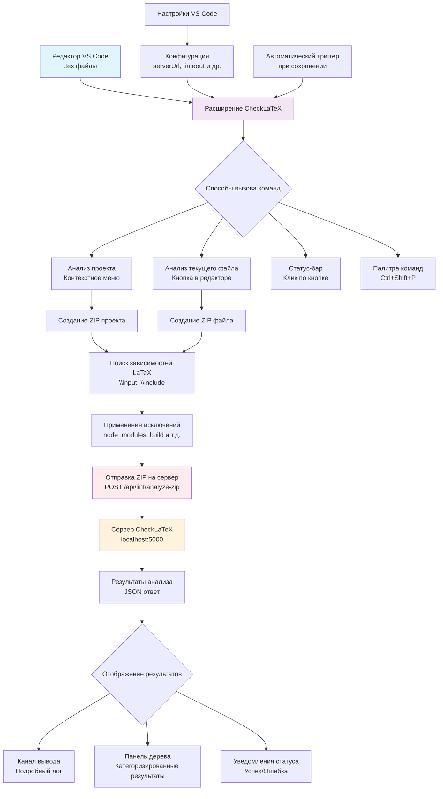

# Архитектура расширения CheckLaTeX

## Диаграмма архитектуры



## Компоненты архитектуры

### 🎯 Точки входа

1. **Редактор VS Code**
   - Работа с .tex файлами
   - Контекстные меню
   - Кнопки в интерфейсе

2. **Способы вызова команд**
   - Контекстное меню (ПКМ на папке/файле)
   - Кнопка в заголовке редактора
   - Статус-бар в нижней части
   - Палитра команд (Ctrl+Shift+P)

### 📦 Обработка файлов

3. **Создание архивов**
   - ZIP проекта (все файлы)
   - ZIP файла (с зависимостями)

4. **Поиск зависимостей**
   - Анализ `\input{...}` команд
   - Анализ `\include{...}` команд
   - Анализ `\subfile{...}` команд

5. **Фильтрация файлов**
   - Применение паттернов исключения
   - Игнорирование служебных папок

### 🌐 Взаимодействие с сервером

6. **HTTP запрос**
   - POST запрос к `/api/lint/analyze-zip`
   - Multipart/form-data с ZIP файлом
   - Опциональный параметр стартового файла

7. **Сервер CheckLaTeX**
   - Получение ZIP архива
   - Анализ LaTeX документов
   - Возврат JSON с результатами

### 📊 Отображение результатов

8. **Варианты отображения**
   - **Канал вывода**: Подробный текстовый лог
   - **Панель дерева**: Структурированные результаты
   - **Уведомления**: Краткие сообщения о статусе

### ⚙️ Конфигурация

9. **Настройки VS Code**
   - `checklatex.serverUrl` - адрес сервера
   - `checklatex.timeout` - таймаут запросов
   - `checklatex.startFile` - главный файл проекта
   - `checklatex.autoAnalyze` - автоанализ при сохранении
   - `checklatex.excludePatterns` - паттерны исключения

10. **Автоматические триггеры**
    - Анализ при сохранении .tex файлов
    - Активация при открытии LaTeX проекта

## Поток данных

1. **Пользователь** выбирает команду анализа
2. **Расширение** собирает файлы проекта
3. **Поиск зависимостей** находит связанные файлы
4. **Фильтрация** исключает ненужные файлы
5. **Архивирование** создает ZIP файл
6. **HTTP запрос** отправляет ZIP на сервер
7. **Сервер** анализирует и возвращает результаты
8. **Расширение** отображает результаты пользователю

## Типы данных

### Запрос к серверу
```typescript
FormData {
  zipFile: Buffer,      // ZIP архив проекта
  startFile?: string    // Опциональный стартовый файл
}
```

### Ответ сервера
```typescript
{
  commandsFound: number,
  testResults: Array<{
    testName: string,
    errors: Array<{
      type: string,
      info: string,
      command?: string
    }>
  }>,
  text: string
}
```

### Конфигурация
```typescript
{
  serverUrl: string,
  startFile: string,
  timeout: number,
  autoAnalyze: boolean,
  excludePatterns: string[]
}
```

## Обработка ошибок

- **Сетевые ошибки**: Отображение в уведомлениях и логе
- **Ошибки сервера**: Парсинг и отображение сообщений
- **Ошибки файловой системы**: Логирование и пропуск файлов
- **Ошибки конфигурации**: Валидация настроек

## Производительность

- **Асинхронная обработка**: Все операции I/O выполняются асинхронно
- **Потоковая архивация**: Создание ZIP без загрузки всех файлов в память
- **Кэширование результатов**: Возможность кэширования для повторных запросов
- **Прогресс-индикаторы**: Отображение состояния длительных операций 